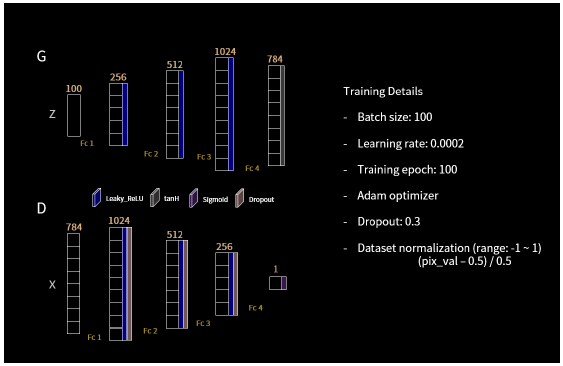
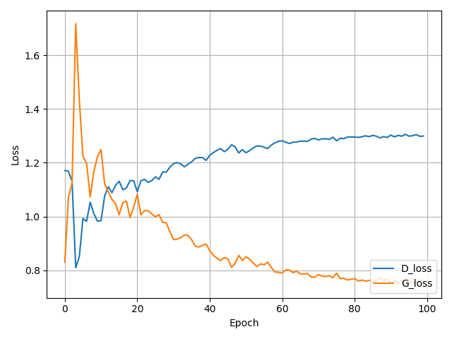
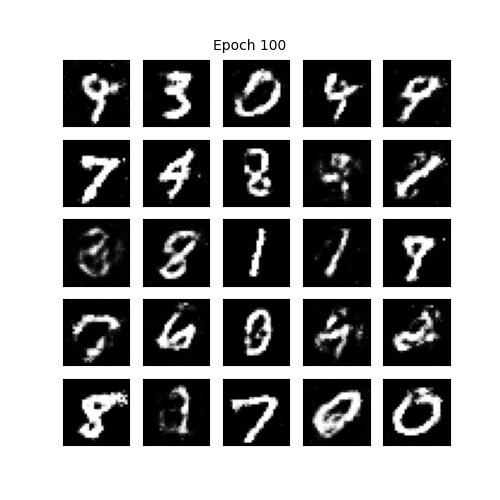

# General Adversarial Networks
GAN based on Ian Goodfellow 2014 paper https://papers.nips.cc/paper/5423-generative-adversarial-nets.pdf

The code runs in tensorflow 1.13.1 and keras 2.0, to run the code 
```
python gan_tensorflow.py
```

The code follows below Generator and Discriminator architecture.


The performance is measured in terms of loss for each ntwork, Generator and Discriminator



The generated image on 100th epoch by generator is as follows


